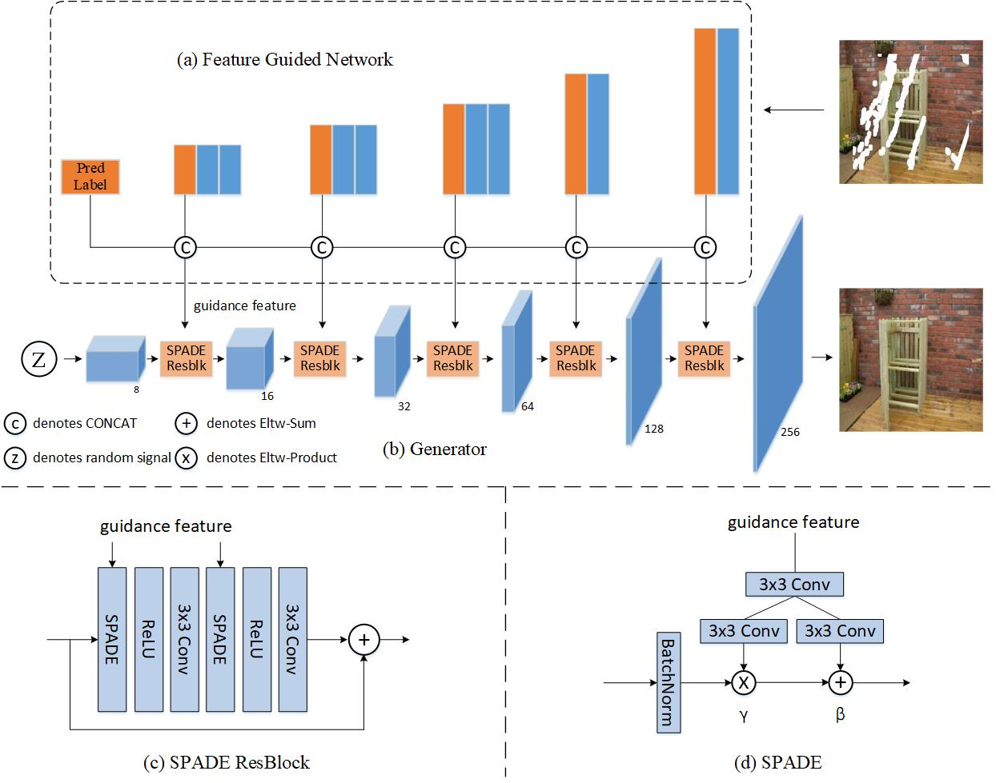
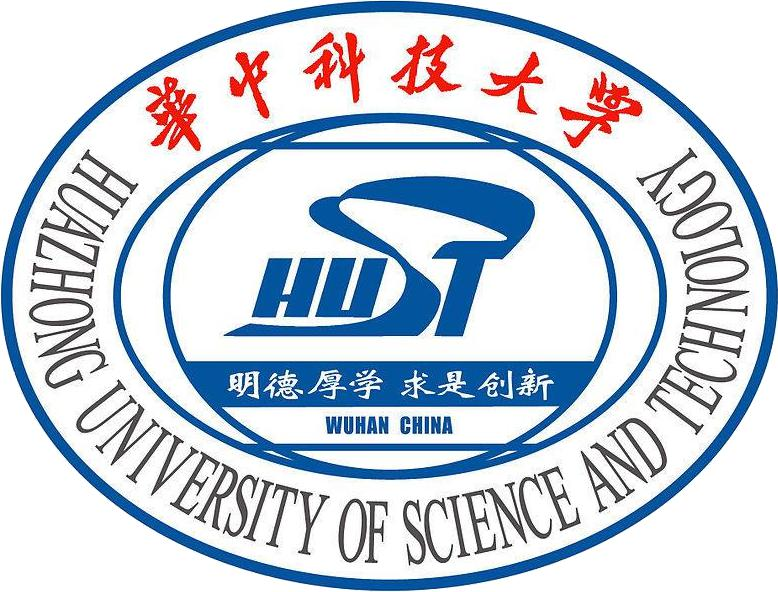
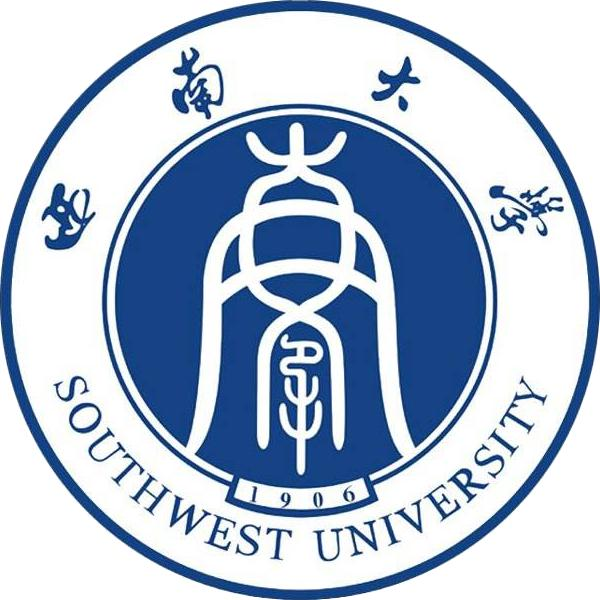

# **Ziqiang Pei 裴自强**

**Research Development Engineer of Autodriving  
ETLab of CAINIAO | Alibaba Group**

School of Artificial Intelligence and Automation (AIA)  
Huazhong University of Science and Technology

Email: [dfzspzq@163.com](mailto:dfzspzq@163.com)  
Github: [ZQPei (1k+)](https://www.github.com/ZQPei)    

## **Biography**
I'm a Master student at BiomGroup of State Key Laboratory for Multispectral Information Processing Technology in Huazhong University of Science and Technology (HUST) since 2017, supervised by Prof. Guoyou Wang. Before that, I obtained my Bachelor of Science degree from South West University in 2013. Later I worked as a high school physics teacher for four years until 2017.  
I will join the ETLab of mobile driving in Alibaba as a Researcher. I am broadly interested in Computer Vision and Deep Learning. My current research focuses on image classification, object detection and image restoration.  

## **Skills**
- Computer: Python, C/C++, Photoshop (skilled)  
- Frameworks: PyTorch, TVM, TensorFlow, Caffe, ONNX
- Languages: English, Mandarin (Native speaker)
- Others: Competent in communications, good leadership and strong teamwork spirits

## **Research Experience**

- **Research Intern in Mobile Autodriving**  
    Jul - Aug 2019  
    ETLab of CAINIAO | Alibaba Group.

  

- **Research Intern in Image Inpainting**  
    Mar - Jun 2019  
    Institute of Deep Learning | Baidu Inc.

## **Competition and Projects**

2019 

- **1st Prize**, Alibaba Cloud German AI Challenge, [[code](https://github.com/ZQPei/Alibaba_Cloud_German_AI_Challenge_for_Earth_Observation)]  

2018-2019

- High speed railway intrusion detection alarm system  

2017-2018

- Detection of key components of power grid  

- **Open Sourced Projects**  
    - Owner Repositories: [DFG-GAN](https://github.com/ZQPei/deep_feature_guided), [deep_sort](https://www.github.com/zqpei/deep_sort_pytorch), [DSSD](https://github.com/ZQPei/DSSD), [deep joint filter](https://github.com/ZQPei/deep_joint_filter)  

    - Participated Projects: [TVM](https://www.github.com/tvm/tvm), [caffe2onnx](https://www.github.com/htshinichi/caffe-onnx)  

## **Publications**
**Conference Papers**

- **Feature Guidance GAN for High Quality Image Restoration**,  
**Ziqiang Pei**, Sheng Yang, Guoyou Wang,  
in the proceedings of International Conference on Digital Image Processing (ICDIP) 2020.  

- **Rotated Faster R-CNN for Oriented Object Detection in Aerial Images**,  
Sheng Yang, **Ziqiang Pei**, Feng Zhou, Guoyou Wang,  
in the proceedings of International Conference on Artificial Intelligence Innovation (ICAII) 2020.  

## **Education Background**

- **M.E. in Pattern Recognition and Intelligent System**    
    State Key Laboratory for Multispectral Information Processing Technology  
    Sep 2017 - Jul 2020 | [Huazhong University of Science and Technology](http://english.hust.edu.cn/)  
    Advisor: [Prof. Guoyou Wang](http://aia.hust.edu.cn/info/1150/3435.htm)

- **B.S. in Physics**   
    Sep 2009 - Jul 2013 | [South West University](http://www.swu.edu.cn/)  
    Advisor: Prof. Junzhong Wang

## **Awards and Honors**

2020

- Outstanding Graduate  

2017-2020

- First-class Scholarship three years in a row  

2010

- First-class Scholarship  

<!--  -->

 unique visitors since Apr 2020
<!--  <a href="https://www.easycounter.com/">HTML Counter</a> -->

<!-- Google Analytics -->
<!--  -->
<!-- End Google Analytics -->
    
